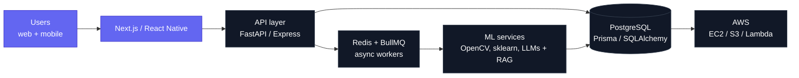

<div align="center">

<a href="https://harshitagrawal.ccbp.tech">

</a>

<br/>

<a href="https://harshitagrawal.ccbp.tech"></a>
<a href="https://linkedin.com/in/harshitagrawal700"></a>
<a href="mailto:harshitagra8092@gmail.com"></a>


</div>

---

### `~ whoami`

```ts
const harshit = {
  role:         "Co-founder & Engineering Lead @ GO-AT Technologies",
  alsoDoing:    "Intern & India Chapter Captain @ DeepStation",
  obsessedWith: ["applied AI", "systems internals", "shipping to real users"],
  building:     "MiniDB - a relational storage engine in C++, from zero",
  philosophy:   "understand the layer below the one you're paid to use",
} as const;
```

Final-year CS (AI/ML) student who likes both ends of the stack: training and wiring up models on
one side, hand-rolling B+ trees and write-ahead logs on the other. Most of what I build ends up in
front of actual users - clients, campuses, or a hackathon jury.

<br/>

## Anatomy of what I ship



<br/>

## Selected work

| Project | Why it is interesting |
| :--- | :--- |
| **MiniDB**<br/><sub>`C++` `B+ Tree` `WAL`</sub> | A relational storage engine written from scratch - disk-backed B+ tree index with node splitting, merging and range scans, a buffer pool with LRU eviction, and a write-ahead log that survives a hard kill. Fronted by a tokeniser and recursive-descent parser compiling a SQL subset into an execution plan. |
| **City Watch**<br/><sub>`Python` `OpenCV` `Deep Learning`</sub> | Computer-vision pipeline that spots road accidents and traffic violations straight off CCTV feeds and fires automated alerts to authorities. Frame sampling to object tracking to detection model, with generated incident summaries for human review. |
| **PriceLens**<br/><sub>`React` `FastAPI` `Redis` `BullMQ`</sub> | E-commerce price intelligence: a retry-safe multi-source scraping pipeline on a Redis/BullMQ job queue, feeding a regression model that forecasts price movement into a live dashboard. |
| **Parchhai**<br/><sub>`Next.js` `Expo` `Prisma` `Neon`</sub> | D2C fashion commerce, end to end - storefront, cross-platform mobile app, cart, checkout, order tracking and admin, all over one shared REST API on Neon Postgres. |
| **Proof-of-Inference**<br/><sub>`Solidity` `Polygon`</sub> | A browser-native cryptocurrency concept where **model inference is the proof of work**. Wrote the whitepaper and the smart contract specification. |

<sub>Also around: **PaperForge** - self-hosted PDF toolkit (React, FastAPI, Docker) &nbsp;·&nbsp; **GuestPay** - prepaid web wallet for paying from borrowed devices (Node, Stripe, Postgres)</sub>

<br/>

## Research

**Judicial Delay Analysis using eCourts Data** - co-authored a study over 173,000+ Indian court
records, using K-Means clustering and gradient boosting to surface where delay actually
accumulates. Manuscript in IEEEtran format, targeting *Springer AI and Law*.

<br/>

## Toolbox

<div align="center">

**Languages**


**AI / ML**


**Build and run**


</div>

<br/>

## Signals

- **Smart India Hackathon 2025** - Grand Finale Runner-Up, national level
- **Founded the DeepStation India chapter** - applied-AI sessions and workshops across Indian campuses
- **ISRO-IIRS Dehradun** intern - AI/ML for geodata: Google Earth Engine, random forests, satellite imagery
- **Founding core member, AWS Cloud Club RIT** &nbsp;·&nbsp; **Head of IT, RITMUNSOC** &nbsp;·&nbsp; IEEE member
- **9.48 CGPA** &nbsp;·&nbsp; mentored **100+ learners** as a Teaching Assistant at NxtWave CCBP 4.0

<br/>

<div align="center">


<br/>


<br/><br/>

<picture>
  <source media="(prefers-color-scheme: dark)" srcset="https://raw.githubusercontent.com/harshitagrawal2O/harshitagrawal2O/output/snake-dark.svg" />
  <source media="(prefers-color-scheme: light)" srcset="https://raw.githubusercontent.com/harshitagrawal2O/harshitagrawal2O/output/snake.svg" />
  
</picture>

<br/><br/>

**Open to software engineering roles where I can own features end to end.**

<sub>Bengaluru, India &nbsp;·&nbsp; <a href="mailto:harshitagra8092@gmail.com">harshitagra8092@gmail.com</a></sub>

</div>
